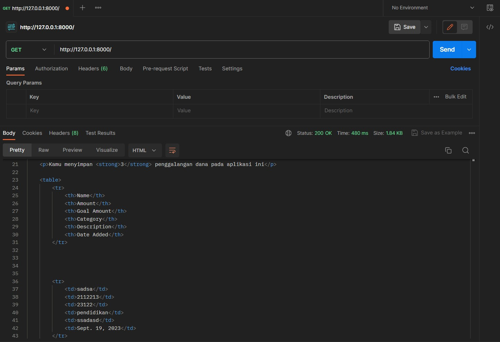
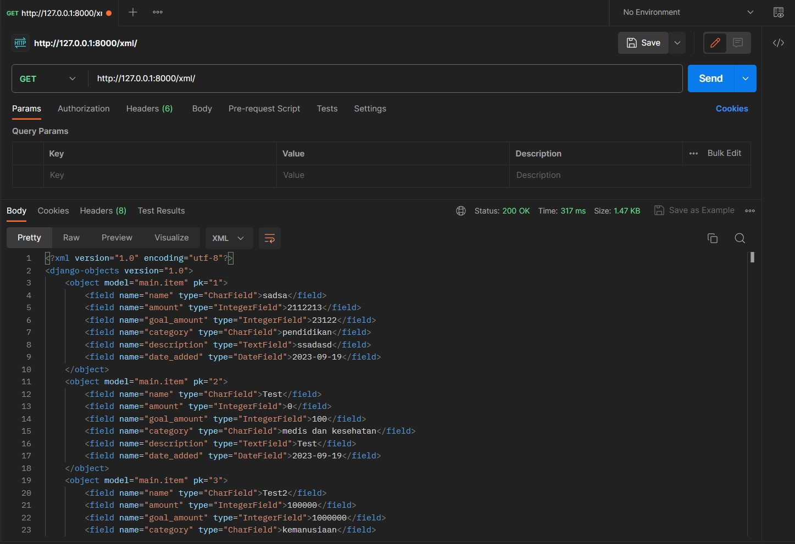
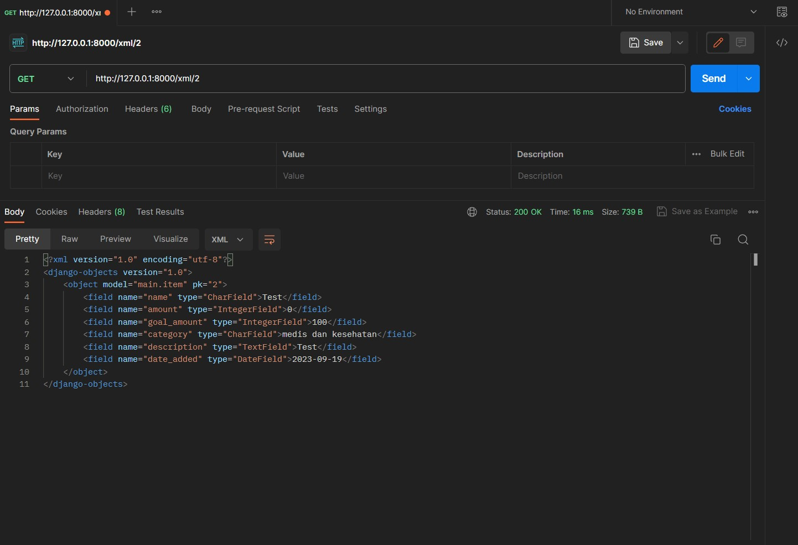
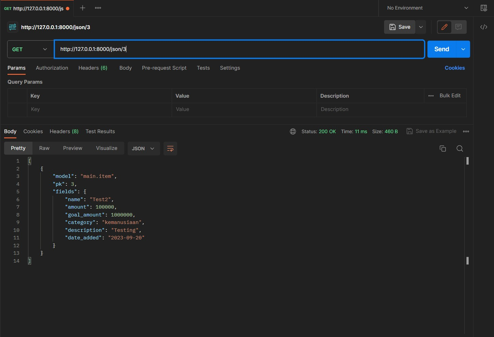

# Tugas 3 PBP  

Nama        : Ratu Nadya Anjania  
NPM         : 2206029752  
Kelas       : PBP F  
Kode Asdos  : FH  
  
## Jawaban Pertanyaan  
  
### Perbedaan antara form ``POST`` dan ``GET`` dalam Django  

#### 1. Cara Kerja
- ``POST:`` _Browser_ membungkus data form -> Menulisnya dalam bentuk sandi untuk transmisi -> Mengirimnya ke server -> Menerima respon kembali   
- ``GET:`` GET membungkus data yg di-_submit_ dalam bentuk _string_ -> Menggunakan _string_ yang dibuat dalam pembuatan URL (terdiri dari alamat ke mana data akan dikirim serta _key_ dan _value_ data).   

#### 2. Penggunaan
- ``POST:`` _Request_ biasanya digunakan untuk mengirim data ke server, terutama untuk _request_ yang melibatkan modifikasi _state system_, seperti perubahan di dalam _database_ (menambahkan atau memperbarui entri _database_).

- ``GET:`` _Request_ biasanya digunakan untuk membaca atau mengambil data dari server (_read-only operations_), cocok untuk request yang tidak memengaruhi _state system_ dan _request_ seperti pencarian web karena URL yang merepresentasikan _request_ GET bisa di-_bookmark_, bagi, atau _submit_ ulang.

#### 3. Kapasitas
- ``POST:`` Tidak memiliki batasan kapasitas yang ketat untuk data yang dikirim (tergantung konfigurasi server).

- ``GET:``
Panjang URL terbatas sehingga jumlah data yang dapat dikirim terbatas. Akibatnya, GET kurang cocok untuk data dalam jumlah besar dan data biner.

#### 4. Keamanan
- ``POST:`` 
    - Lebih aman dan terkontrol untuk data sensitif, dipadukan dengan perlindungan lain seperti perlindungan CSRF Django.
    - Data _form_ tidak terlihat di URL, melainkan di _request body_.
- ``GET:``
    - Memiliki risiko keamanan (seperti risiko peniruan _request form_ untuk memperoleh akses ke bagian sensitif sistem). 
    - Data _form_ terlihat dalam bentuk teks biasa di URL, riwayat _browser_, dan log server sehingga tidak cocok untuk data sensitif seperti kata sandi. 

#### 5. HTTP Status
- ``POST:`` Ketika sukses, server mengembalikan kode status HTTP 201 (atau 200 (OK) tergantung implementasi aplikasi).
- ``GET:`` Jika data berhasil diambil, mengembalikan kode status HTTP 200 (OK).
  
### Perbedaan utama antara XML, JSON, dan HTML dalam konteks pengiriman data  

|                                    **XML**                                   |                                            **JSON**                                            |                                                     **HTML**                                                     |
|:----------------------------------------------------------------------------:|:----------------------------------------------------------------------------------------------:|:----------------------------------------------------------------------------------------------------------------:|
| Menyimpan dan menampilkan data  dalam bentuk _tree structure_                | Menyimpan dan menampilkan data  dalam bentuk pasangan _name_ dan  _value_ yang dipisahkan koma | Serupa dengan XML, tetapi umumnya menampilkan  data ke _end-user_ dalam bentuk visualisasi  dari data mentah     |
| Digunakan untuk menyimpan dan  bertukar data yang kompleks atau terstruktur  | Digunakan untuk menyimpan dan  bertukar data, memiliki format ringkas dan mudah dibaca         | Utamanya digunakan untuk menyajikan konten kepada _end-users_ dan secara umum bukan untuk pertukaran data mentah |
| Tidak mendukung penggunaan _array_                                           | Mendukung struktur data _array_                                                                | Mendukung struktur mirip _array_, yaitu _ordered list_ dan _unordered list_                                      |
| Menggunakan _start_ dan _end_ tag yang merepresentasikan data  dengan detail | Tidak menggunakan _end_ tag                                                                    | Menggunakan _start_ dan _end_ tag untuk mendefinisikan elemen dalam _web page_                                     |
| Mendukung penggunaan _namespaces_                                            | Tidak mendukung penggunaan _namespaces_ dan komentar                                           | Mendukung _namespaces_ secara terbatas (dalam konteks xhtml)                                                     |

### Alasan JSON sering digunakan dalam pertukaran data antara aplikasi web modern

JSON sering digunakan dalam pertukaran data antara aplikasi web modern karena:

#### 1. Sederhana dan Fleksibel
- JSON memungkinkan struktur data kompleks untuk ditampilkan dalam format pasangan _key-value_ dan _arrays_ yang ringkas dan mudah dibaca (_self-descriptive_ dan _human-readable_). 
- Format JSON secara _syntax_ identik dengan kode untuk membuat objek JavaScript. Karena kemiripan ini, program JavaScript dapat mengubah data JSON menjadi objek JavaScript dengan mudah. Hal ini akan memudahkan pengembang web yang menggunakan JavaScript sebagai bahasa skrip utama untuk aplikasi web mereka.
  
#### 2. Kompatibilitas
- Memiliki kompatibilitas dan interoperabilitas dengan berbagai bahasa, platform, dan framework.
- Didukung oleh banyak _browser_ modern, web _APIs_, dan web server. Hal ini memudahkan pertukaran data.
- Dapat digunakan dengan berbagai _library_ dan alat yang menyediakan fungsi untuk memvalidasi, mengurai, mengubah, dan memanipulasi data JSON (contoh: jQuery).

#### 3. Performa
- Ukurannya lebih kecil dan strukturnya lebih sederhana sehingga biasanya lebih cepat dan ringan dibandingkan XML.
- Tidak memiliki informasi yang tidak perlu yang dapat meningkatkan _overhead_ dan kompleksitas seperti pada XML (contoh: _closing tag_, _namespace_, dsb.).
- Dengan mengurangi _bandwidth_ dan waktu pemrosesan transfer dan manipulasi data, JSON dapat meningkatkan kecepatan dan daya tanggap aplikasi web. 

### Implementasi checklist secara step-by-step   
  
#### Membuat input form untuk menambahkan objek model pada app sebelumnya

- Membuat berkas ``forms.py`` dan mendefinisikan Class ``ItemForm`` yang menerima data item. Dalam kasus saya, ia menerima data item ``name``, ``amount``, ``goal_amount``, ``category``, ``description``.
- Membuat fungsi ``create_item`` dalam berkas ``views.`` untuk menghasilkan formulir yang dapat menambahkan data item baru ketika data di-_submit_. Data yang masuk akan disimpan ke dalam _database_.
- Mengubah fungsi ``show_main`` dalam ``views.py`` untuk mengambil dan menampilkan data item dari _database_.
- Menambah _path_ URL ke dalam ``urls.py`` agar aplikasi dapat mengakses ``create_item``.
- Membuat halaman ``create_item.html`` untuk menampilkan formulir input data produk.
- Menambahkan kode berikut untuk menampilkan data dalam bentuk tabel serta tombol "Buat Galang Dana" yang akan _redirect_ ke halaman form:

```
...
<table>
        <tr>
            <th>Name</th>
            <th>Amount</th>
            <th>Goal Amount</th>
            <th>Category</th>
            <th>Description</th>
            <th>Date Added</th>
        </tr>

         Berikut cara memperlihatkan data produk di bawah baris ini 

        
            <tr>
                <td>{{item.name}}</td>
                <td>{{item.amount}}</td>
                <td>{{item.goal_amount}}</td>
                <td>{{item.category}}</td>
                <td>{{item.description}}</td>
                <td>{{item.date_added}}</td>
            </tr>
        
    </table>

    <br />

    <a href="">
        <button>
            Buat Galang Dana
        </button>
    </a>


```

  
#### Tambahkan 5 fungsi view untuk melihat objek yang sudah ditambahkan dalam format HTML, XML, JSON, XML _by ID_, dan JSON by ID

**HTML**  
- Pada fungsi ``show_main`` di ``views.py``, membuat variabel baru bernama ``items`` yang menyimpan hasil _query_ dari data dengan meng-_assign_ ``Item.objects.all()``.
- Menambahkan _key_ ``‘items’`` dan _value_ ``items`` pada _dictionary_ ``context`` untuk mengirim data item ke tampilan.

**XML/JSON/XML by ID/JSON by JD**  
- Melakukan impor ``HttpResponse`` dan ``Serializer`` (digunakan untuk mentranslasi objek model).
- Membuat fungsi view ``show_[xml/json/xml_by_id/json_by_id]`` yang menerima parameter ``request``.
- Membuat variabel ``data`` yang menyimpan hasil _query_ dari data Item (dengan meng-_assign_ fungsi ``Item.objects.all()`` untuk XML dan JSON, ``.filter(pk=id)`` untuk XML JSON berdasarkan ID) dan menambahkan _return function_ berupa ``HttpResponse`` dengan parameter hasil _query_ yang sudah diserialisasi dan parameter ``content_type=“application/[xml/json]“``
- Mengimpor fungsi yang sudah dibuat
- Membuat _routing_ URL agar fungsi yang sudah diimpor dapat diakses

#### Membuat _routing_ URL untuk masing-masing ``views`` yang telah ditambahkan pada poin sebelumnya
  
Menambahkan fungsi path dalam berkas urls.py di direktori aplikasi sebagai berikut:

```
urlpatterns = [
    path('', show_main, name='show_main'),
    path('create-item', create_item, name='create_item'),
    path('xml/', show_xml, name='show_xml'),
    path('json/', show_json, name='show_json'),
    path('xml/<int:id>/', show_xml_by_id, name='show_xml_by_id'),
    path('json/<int:id>/', show_json_by_id, name='show_json_by_id'),
]
```

masing-masing path akan mengarahkan URL ke fungsi view yang sesuai.

### Screenshot hasil akses URL pada Postman

#### HTML



#### XML



#### JSON


#### XML _by ID_



#### JSON _by ID_

