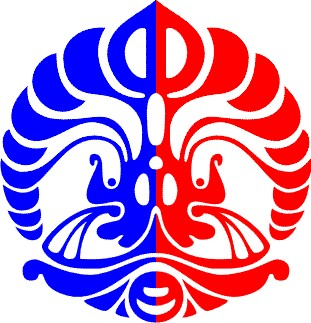
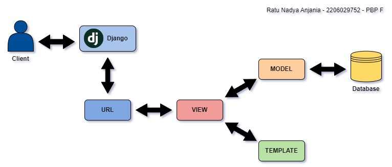

# Tugas 2 PBP



Nama        : Ratu Nadya Anjania
NPM         : 2206029752
Kelas       : PBP F
Kode Asdos  : FH

## Tautan Adaptable

Tautan: **[https://donate.adaptable.app/](https://donate.adaptable.app/)**.

## Jawaban Pertanyaan

### 1. Implementasi checklist pada soal secara step-by-step

##### Membuat sebuah proyek Django baru  

> - Buat repositori baru dan _folder_ (direktori lokal proyek).  
> - Setup repositori pada terminal/_command prompt_ direktori lokal yang sudah dibuat:  
>    - Inisiasi git, buat berkas README.md dalam direktori lokal proyek yang kemudian di-_track_ untuk di-_commit_ (_add_), buat _commit_, hubungkan repositori lokal dengan repositori di GitHub, simpan perubahan ke GitHub.  
> - Buat dan aktifkan _virtual environment_  
> - Buat _file_ `requirements.txt` berisi _dependencies_ dan pasang dengan perintah pip install -r requirements.txt  
> - Buat proyek Django bernama `django_mvt` dengan perintah django-admin startproject django_mvt .  

##### Membuat aplikasi dengan nama main pada proyek tersebut  

> - Buka _folder_ direktori utama, lalu terminal dari direktori tersebut  
> - Aktifkan virtual environment dan jalankan perintah python manage.py startapp main  

##### Melakukan routing pada proyek agar dapat menjalankan aplikasi main  

> - Buka _file_ `settings.py` pada _folder_ direktori proyek dan tambahkan 'main' pada daftar aplikasi yang ada di list INSTALLED_APPS  

##### Membuat model pada aplikasi main dengan nama Item yang memiliki atribut (name, amount, goal_amount, category, description)  

> - Buka _file_ `models.py` pada direktori aplikasi main dan buat _Class_ bernama Item  
> - Di dalam _Class_, buat:  
>    - Atribut wajib:  
>        name (CharField)  
>        amount (IntegerField)  
>        description (TextField)  
>    - Atribut tambahan:  
>        goal_amount (IntegerField)  
>        category (CharField)  
>    - _Tuple_ category_choices untuk _dropdown_ atribut category

##### Membuat fungsi pada views.py untuk dikembalikan ke dalam sebuah template HTML yang menampilkan nama aplikasi serta nama dan kelas kamu  

> Buat fungsi bernama `show_main` pada `views.py` dengan parameter request dan kembalian berupa objek HttpResponse dengan teks yang dirender yang selanjutnya di-assign ke template `main.html`. Fungsi ini memiliki dictionary `context` dengan key dan value yang tertera pada kode di bawah ini. Fungsi ini menggabungkan template dan context dictionary tersebut.  
```
def show_main(request):
    context = {
        'app_name': 'Aplikasi Pengelola Donasi',
        'name': 'Ratu Nadya A.',
        'class': 'PBP F'
    }

    return render(request, "main.html", context)
```

##### Membuat sebuah routing pada urls.py aplikasi main untuk memetakan fungsi yang telah dibuat pada views.py  

> - Tambah fungsi path dalam _file_ `urls.py` di direktori proyek di `urlpatterns` dengan argumen `('', include('main.urls'))` untuk mengarahkan ke _file_ `urls.py` di direktori aplikasi.  
> - Buat `urls.py` pada direktori aplikasi main dan tambahkan `urlpatterns` dengan `path` yang memiliki argumen seperti di bawah agar dapat menampilkan _file_ html yang akan dipanggil oleh fungsi yang telah dibuat pada `views.py`.  
```
urlpatterns = [
    path('', show_main, name='show_main')
] 
```

##### Melakukan deployment ke Adaptable terhadap aplikasi yang sudah dibuat  

> - Buka terminal dan jalankan git add, commit, push  
> - Login pada adaptable, klik tombol New App, lalu Connect an Existing Repository  
> - Pilih basis aplikasi yang di-deploy (repositori proyek)  
> - Pilih deployment branch (main), template deployment (Python App Template), tipe basis data (PostgreSQL), dan versi python (3.11)  
> - Masukkan perintah `python manage.py migrate && gunicorn django-mvt.wsgi` pada Start Command  
> - Tuliskan nama aplikasi  
> - Centang HTTP Listener on Port  
> - Tekan tombol Deploy Ap, selesai :>  

##### Membuat sebuah README.md yang berisi tautan menuju aplikasi Adaptable yang sudah di-deploy, serta jawaban dari beberapa pertanyaan yang telah diberikan

> Tuliskan jawaban dari pertanyaan pada _file_ `README.md` yang telah dibuat. 
  
### 2. Bagan request client ke web aplikasi berbasis Django beserta respon dan penjelasan pada bagan tersebut kaitan antara urls.py, views.py, models.py, dan berkas html.



*Penjelasan:*
_Request_ yang masuk ke server Django akan diproses melalui _URL_, lalu diteruskan ke _view_ dan diproses. Jika peran database diperlukan, _view_ akan memanggil _query_ ke _model_ dan _database_ dan hasilnya akan dikembalikan ke _view_. Setelah itu, hasil tersebut akan dipetakan ke dalam HTML yang sudah didefinisikan dan dikembalikan ke pengguna sebagai HTML response.  

### 3. Jelaskan mengapa kita menggunakan virtual environment? Apakah kita tetap dapat membuat aplikasi web berbasis Django tanpa menggunakan virtual environment?

_Virtual environment_ kita gunakan untuk mengisolasi _dependencies_ serta _package_ yang dibutuhkan oleh proyek. Hal ini dapat mencegah konflik antara penggunaan versi _dependencies_ kebutuhan proyek yang berbeda di komputer yang sama.  
  
Kita tetap dapat membuat aplikasi web berbasis Django tanpa menggunakan _virtual environment_, tetapi tindakan tersebut rawan berbagai masalah, seperti konflik antar-_dependencies_ seperti yang disebutkan, pengelolaan _dependencies_ yang lebih sulit, gangguan kinerja sistem operasi, dan sebagainya.

### 4. Jelaskan apakah itu MVC, MVT, MVVM dan perbedaan dari ketiganya.
  
Ketiganya merupakan pola desain atau arsitektur untuk pengembangan web untuk memisahkan komponen-komponen berdasarkan fungsinya.  
  
- **MVC (_Model, View, Controller_)**:  
    - ***Model***: Komponen inti dari arsitektur MVC yang bertanggung jawab terkait segala data, logika, dan aturan aplikasi.  
    - ***View***: Komponen yang menangani tampilan data kepada user yang berisi representasi data dari _model_.   
    - ***Controller***: Komponen yang menjembatani _model_ dan _view_. Komponen ini memanipulasi data dan me-_render_ _view_.  
- **MVT (_Model, View, Template_)**:  
    - ***Model***: Komponen pengatur dan pengelola data dan interaksinya, serta penghubung aplikasi dengan basis data.  
    - ***View***: Komponen logika utama yang menghubungkan model dan template dalam memproses _request_ dari _client_.  
    - ***Template***: Komponen untuk menangani _user interface_ atau mengatur tampilan yang berisi data dari _model_ yang didapat melalui _view_.  
- **MVVM (_Model, View, ViewModel_)**:  
    - ***Model***: Komponen nonvisual yang mengelola data.  
    - ***View***: Komponen yang menangani struktur dan tampilan yang dilihat oleh client, representasi model, dan menerima interaksi client.  
    - ***ViewModel***: Komponen penghubung antara _view_ dan _model_ yang mengimplementasikan perintah dan properti yang bisa menjadi sarana pengikatan data oleh _view_. Jika terdapat perubahan _state_, _ViewModel_ memberi informasi kepada _view_.  
  
Perbedaan ketiganya terletak di peran komponen mediator. MVC memiliki _controller_ yang menjadi mediator antara _model_ dan _view_. MVT menggunakan _view_ sebagai mediator antara _model_ dan _template_. Sementara itu, MVVM melibatkan _ViewModel_ sebagai mediator _model_ dan _view_ yang menggunakan _data-binding_.